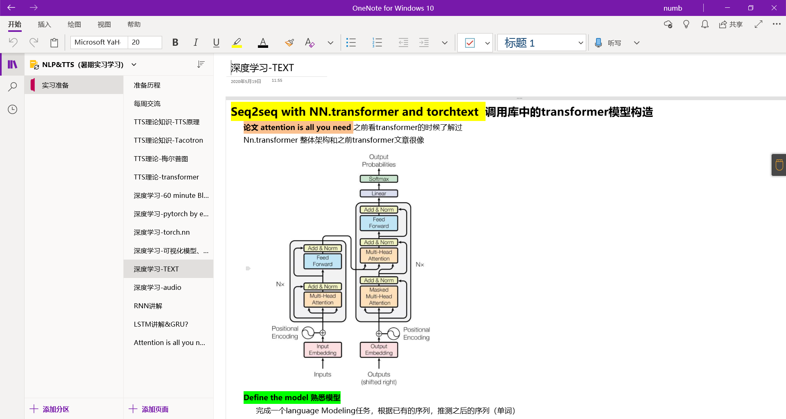

# study_pytorch

## before文件夹

cifar10_tutorial是pytorch官方教程的十类图片分类器

data_parallel_tutorial是关于数据并行处理的代码

two_layer_network是自行练习的简单两个fc层神经网络

cnn_minist是自行编写的针对minist数据集的卷积神经网络架构

cnn_bees&ants是利用现有ResNet架构迁移学习得到的图片二分器

## TTS一知实习准备

### 60minute

基本的torch操作练习与熟悉

### NLP&TTS相关论文理论知识学习与实践

实践代码见本目录中其他文件夹，学习笔记用onenote做了记录。

